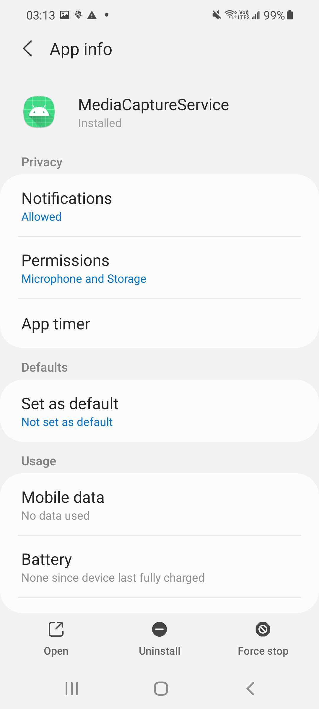
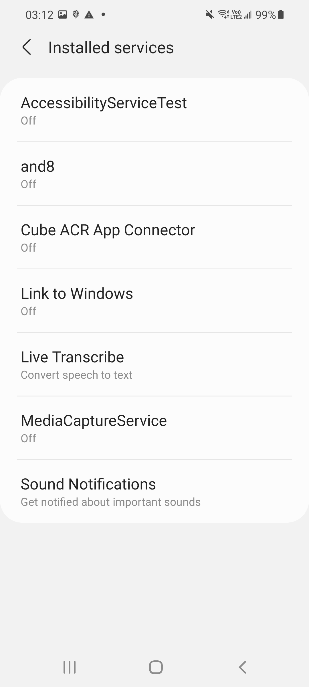
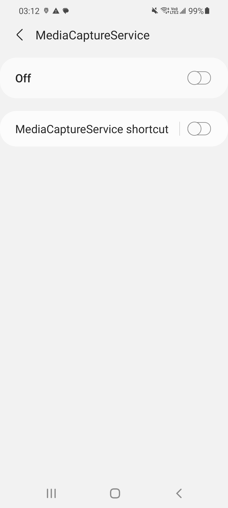

# README

## NOTICE
This is a very simple AccessibilityService for phone call recording.
NO PERMISSION CHECK!!
NO PHONE CALL DETECT!!

Please configure your device properly before running the service.
#### Allow the permission
Check if all the permissions are all allowed.
(No run time request, so the app will abort if the permission not granted)

Go to **MediaCaptureService**

Start or stop recording using the button on the top; do not enable the bottom button.
When running the app on Android Studio on a device, there might be an app's homepage shown on the screen.
Just ignore it and toggle the button to check the recording function.

## Install the app and server
Each branch contains a distinct feature.  
To work with or download a specific part of the project, switch to its corresponding branch:
- server
- accessibility
- app (ongoing / maybe needed for old cellphone without accessibility function)